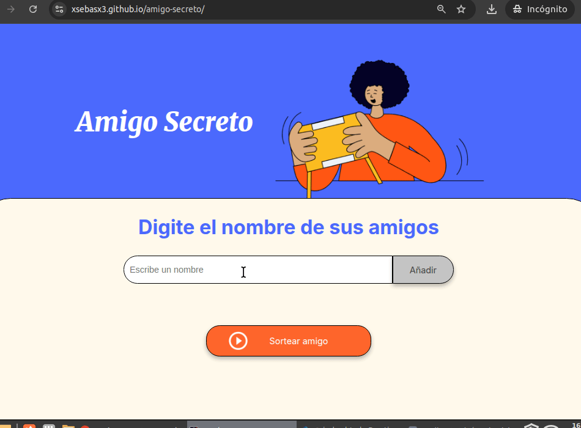

# Amigo Secreto

## 🏅 Insignias

---

## 📌 Índice

- [Descripción del Proyecto](#-descripción-del-proyecto)
- [Estado del Proyecto](#-estado-del-proyecto)
- [Demostración de Funciones y Aplicaciones](#-demostración-de-funciones-y-aplicaciones)
- [Acceso al Proyecto](#-acceso-al-proyecto)
- [Tecnologías Utilizadas](#-tecnologías-utilizadas)
- [Personas Desarrolladoras del Proyecto](#-personas-desarrolladoras-del-proyecto)

---

## 📖 Descripción del Proyecto

**Amigo Secreto** es una aplicación web interactiva que permite a los usuarios ingresar nombres de amigos en una lista y realizar un sorteo aleatorio para determinar quién será el "amigo secreto". La herramienta es fácil de usar y ayuda a organizar sorteos de manera sencilla y divertida.

### 🔹 Funcionalidades principales:

- Agregar nombres de amigos a una lista.
- Validar que los nombres ingresados no estén vacíos.
- Mostrar la lista de amigos en la interfaz.
- Sortear un amigo secreto de manera aleatoria.
- Mostrar el resultado del sorteo en pantalla.

---

## 🚀 Estado del Proyecto

📌 **Finalizado** - Se han implementado todas las funcionalidades básicas requeridas para el proyecto.

---

## 🎥 Demostración de Funciones y Aplicaciones

📌 **Agregar Amigos**: Los usuarios pueden escribir nombres en un campo de texto y agregarlos a una lista visible.

📌 **Lista de Amigos**: Los nombres ingresados aparecen en una lista debajo del campo de entrada.

📌 **Sorteo Aleatorio**: Al hacer clic en el botón "Sortear Amigo", se selecciona un nombre aleatoriamente y se muestra en pantalla.

---

## 🔗 Acceso al Proyecto

Puedes acceder al proyecto en vivo aquí: [https://xsebasx3.github.io/amigo-secreto/](#)

Para clonar este repositorio en tu máquina local, usa el siguiente comando:

bash
  git clone https://github.com/usuario/amigo-secreto.git

---

## 🛠️ Tecnologías Utilizadas

- **HTML5** → Estructura de la aplicación.
- **CSS3** → Estilos y diseño responsive.
- **JavaScript (ES6)** → Lógica de la aplicación y manipulación del DOM.

---

## 👨‍💻 Personas Desarrolladoras del Proyecto

- [Sebastian Chavez](https://github.com/xsebasx3)

---

